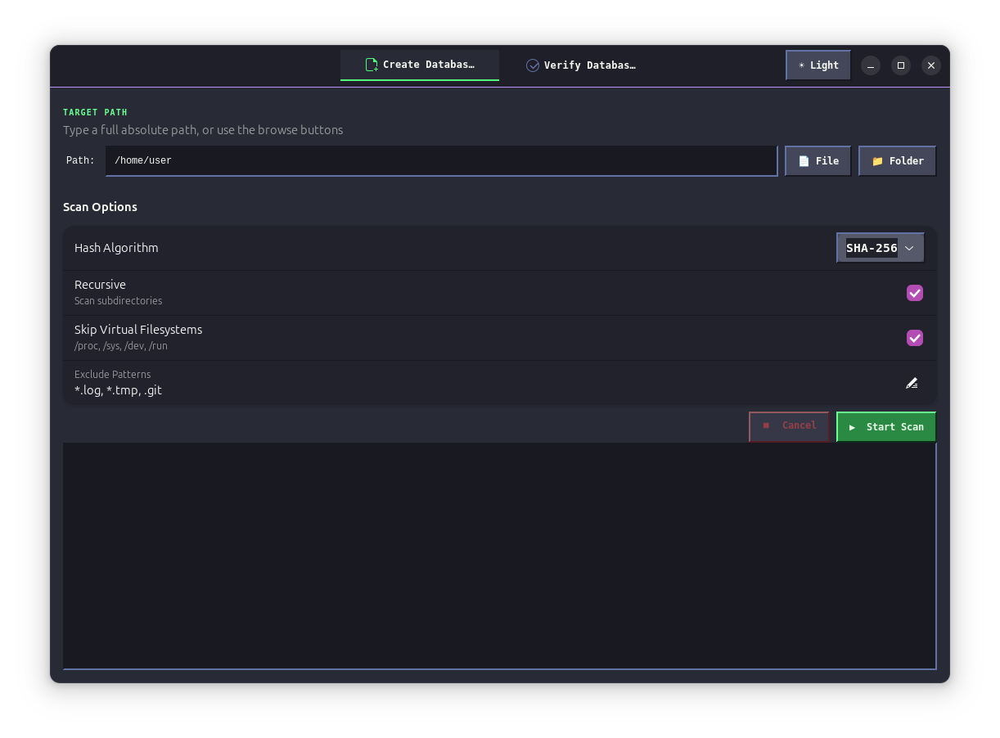
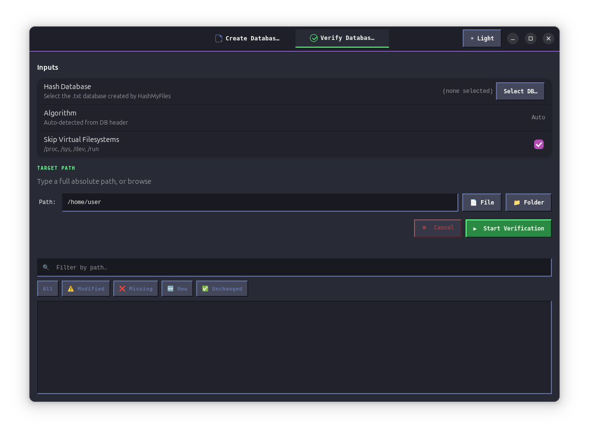

# HashMyFiles

A professional file integrity scanner and verifier for Linux, built with **Rust + GTK4 + libadwaita**.


### Screenshots

<p align="center">
  
  
</p>

---

## Features

| Feature | Detail |
|---|---|
| **Hash algorithms** | SHA-256 (default), SHA-512, BLAKE3 |
| **Multi-threaded** | rayon parallel hashing — saturates all CPU cores |
| **Large file support** | Chunked reads (8 MB), no RAM pressure |
| **Cancellable scans** | `AtomicBool` cancellation flag on all background work |
| **Verification diff** | ✅ Unchanged · ⚠️ Modified · ❌ Missing · 🆕 New |
| **Interactive diff** | Colour-coded list with old/new hash detail |
| **Export formats** | `.txt`, `.json`, `.csv` |
| **Exclude patterns** | Glob patterns: `*.log`, `*.tmp`, `.git` |
| **Virtual FS safety** | Skip `/proc`, `/sys`, `/dev`, `/run` (user-toggleable) |
| **Sudo handling** | Detects protected dirs, offers pkexec relaunch |
| **DB auto-detect** | Metadata header enables algorithm auto-detection on verify |

---


---

## Installation

### Pre-built packages (recommended)

Download from the [Releases](https://github.com/jegly/HashMyFiles/releases) page:

```bash
# Ubuntu / Debian (.deb)
sudo dpkg -i hashmyfiles_*_amd64.deb

```

### Build from source

**Requirements:** Ubuntu 23.04+ or equivalent with GTK 4.10+

```bash
# Install build dependencies
sudo apt install \
    libgtk-4-dev \
    libadwaita-1-dev \
    libglib2.0-dev \
    pkg-config \
    cargo

# Clone and build
git clone https://github.com/yourusername/hashmyfiles.git
cd hashmyfiles
cargo build --release

# Run
./target/release/hashmyfiles
```

---

## Usage

### Create a Hash Database

1. Open the **Create Database** tab.
2. Click **Browse…** to select a file, folder, or `/` for the whole system.
3. Choose a hash algorithm (SHA-256 is default).
4. Configure options: recursive scan, exclude patterns, virtual FS skip.
5. Click **▶ Start Scan**.
6. When complete, a save dialog appears — the default filename is `hash_sha256_YYYYMMDD_HHMMSS.txt`.

### Verify Integrity

1. Open the **Verify Database** tab.
2. Select the `.txt` database file created previously.
3. Select the directory to verify.
4. Click **▶ Start Verification**.
5. Results appear in the diff viewer — colour-coded by status.
6. Export results via **Export .txt / .json / .csv**.

### Database Format

```
# hashmyfiles v1.0
# algorithm=sha256
# created=2025-01-15T10:30:00+1000
# entries=42183
#
a3f1c8e2...d7b4  /home/user/documents/report.pdf
9c2e4f11...8a01  /home/user/documents/notes.txt
```

The header enables algorithm auto-detection when loading for verification.

---

## Architecture

```
src/
├── main.rs          Entry point
├── app.rs           AdwApplication setup
├── hasher.rs        SHA-256 / SHA-512 / BLAKE3, chunked reads
├── scanner.rs       rayon parallel scan, AtomicBool cancel, glob exclusions
├── verifier.rs      Diff engine — produces DiffEntry per file
├── database.rs      DB read/write, JSON/CSV export
├── utils.rs         Root detection, pkexec relaunch, sudo dialog
└── ui/
    ├── window.rs    AdwApplicationWindow + ViewStack tabs
    ├── create_tab.rs  Create Database UI + glib channel threading
    ├── verify_tab.rs  Verify Database UI + export buttons
    └── diff_viewer.rs Interactive colour-coded diff list
```

### Threading model

All background work runs on `std::thread` threads (not tokio). Progress updates flow back to the GTK main thread via `glib::MainContext::channel`. This avoids the dual-runtime problem and keeps GTK's single-threaded requirement intact.

```
┌─────────────────────────────────────────────────────┐
│  GTK Main Thread                                    │
│  ┌──────────────────────────────────────────────┐  │
│  │  glib::MainContext::channel (receiver)        │  │
│  └──────────────────────┬───────────────────────┘  │
│                         │ ScanMessage::Progress     │
│                         │ ScanMessage::Done         │
└─────────────────────────┼───────────────────────────┘
                          │
        ┌─────────────────▼──────────────────────┐
        │  std::thread (background)               │
        │                                         │
        │  scanner::scan_files()                  │
        │    └── rayon::par_iter() [all cores]   │
        │          └── hasher::hash_file()        │
        └─────────────────────────────────────────┘
```

---

## Minimum requirements

| Component | Minimum version |
|---|---|
| Ubuntu / Debian | Ubuntu 23.04 / Debian 12 |
| Fedora | Fedora 38 |
| GTK | 4.10 |
| libadwaita | 1.4 |
| Rust | 1.75 (stable) |

---

## License

MIT — see [LICENSE](LICENSE).

JEGLY / CLAUDE 


